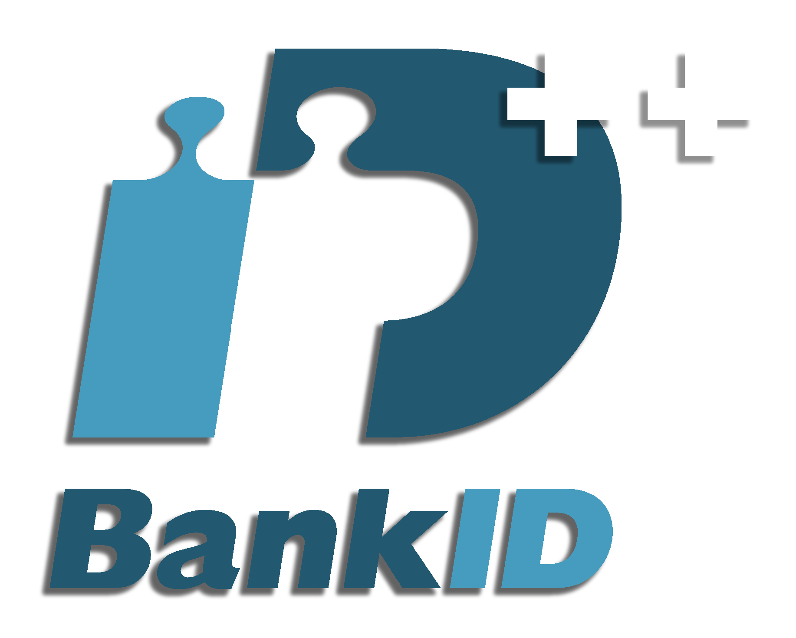

# BankID C++ Library and Server

<div align="center">
  
</div>

A comprehensive C++ library and REST API server for BankID authentication, built with modern C++ standards and designed for both Windows and cross-platform development.

## Table of Contents

- [Overview](#overview)
- [Project Structure](#project-structure)
- [Features](#features)
- [Prerequisites](#prerequisites)
- [Building and Configuration](#building-and-configuration)
- [Using the Library with FetchContent](#using-the-library-with-fetchcontent)
- [API Endpoints](#api-endpoints)
- [Code Examples](#code-examples)
- [SSL Certificate Setup](#ssl-certificate-setup)
- [QR Code Generation](#qr-code-generation)
- [Running Tests](#running-tests)
- [Library Linking Options](#library-linking-options)
- [Certificate Security Warning](#️-certificate-security-warning)
- [Contributing](#contributing)
- [Contact](#contact)

## Overview

This project provides a comprehensive **BankID C++ library** that implements the complete BankID API for authentication, signing, and payment operations. The library is designed for easy integration into your own applications and includes a simple HTTP server example to demonstrate its usage.

> [!NOTE] 
> **Focus**: The primary goal is to provide a robust, production-ready BankID library. The included server is just a demonstration example.

### Key Features

- **Full BankID API Coverage**: Auth, Sign, Payment, Phone Auth, Phone Sign, Other Payment, Collect, and Cancel
- **Modern C++**: Built with C++23 standards using `std::expected` for error handling
- **Easy Integration**: Simple API designed for seamless integration into your applications
- **Cross-Platform**: Windows DLL support with cross-platform compatibility
- **QR Code Generation**: Built-in QR code generator with automatic caching
- **Comprehensive Testing**: Google Test framework integration
- **SSL/TLS Support**: OpenSSL integration for secure communication
- **Example HTTP Server**: Demo server built with CrowCpp to showcase library usage

> [!WARNING] 
> **Important**: To test the library or demo server, you will need a **BankID test account** and valid test certificates from BankID.

## Features

### BankID API Endpoints

- **Authentication (`/auth`)**: Standard BankID authentication
- **Signing (`/sign`)**: Document signing with BankID
- **Payment (`/payment`)**: Payment authorization
- **Phone Authentication (`/phone/auth`)**: Mobile-based authentication
- **Phone Signing (`/phone/sign`)**: Mobile-based signing
- **Other Payment (`/other/payment`)**: Alternative payment methods
- **Collect (`/collect`)**: Status polling and result collection
- **Cancel (`/cancel`)**: Order cancellation

### Advanced Features

- **QR Code Generation**: Automatic QR code generation and caching for seamless user experience
- **SSL/TLS Security**: Full OpenSSL integration for secure communication
- **Error Handling**: Comprehensive error handling with `std::expected`
- **Multi-threading**: Thread-safe operations and concurrent request handling
- **Environment Support**: Both TEST and PRODUCTION environment configurations

## Prerequisites

### Required Tools

- **Visual Studio 2022** (MSVC v143 or later)
- **CMake 3.28+**
- **Conan 2.0+** (optional, for dependency management)
- **Python 3.8+** (for Conan virtual environment or FetchContent)

### System Requirements

- Windows 10/11 (primary target)
- .NET Framework 4.8+ (for Visual Studio)
- Git for Windows

## Building and Configuration

### 1. Setup Python Virtual Environment (Optional for Conan)

```bash
# Create virtual environment for Conan
python -m venv conan_venv

# Activate virtual environment
# On Windows (Command Prompt):
conan_venv\Scripts\activate.bat
# On Windows (PowerShell):
conan_venv\Scripts\Activate.ps1
# On Windows (Git Bash):
source conan_venv/Scripts/activate

# Install Conan 2
pip install conan>=2.0
```

### 2. Install Dependencies with Conan

```bash
# Install dependencies and generate build files
conan install . -s build_type=Debug -of=conan/debug --build=missing

# For Release build
conan install . -s build_type=Release -of=conan/release --build=missing
```

### 3. Build Options

#### Build as Static Library (Default)

```bash
# Configure using Visual Studio 2022 Debug preset
cmake --preset vs2022-deb

# Build the library and server
cmake --build build/vs2022-deb --config Debug

# Run server (cd into directory to ensure correct certificate paths)
cd build/vs2022-deb/server/Debug && ./bankid_server.exe
```

#### Build as Shared Library/DLL

```bash
# Configure with shared libraries enabled
cmake --preset vs2022-deb-shared

# Build
cmake --build build/vs2022-deb-shared --config Debug

# Run server (cd into directory to ensure correct certificate paths)
cd build/vs2022-deb-shared/server/Debug && ./bankid_server.exe
```

#### VS Code Integration

Use the provided VS Code tasks:

- `Ctrl+Shift+P` → "Tasks: Run Task" → "Run Server (Static)"
- `Ctrl+Shift+P` → "Tasks: Run Task" → "Run Server (Shared)"

### 4. Install Library

```bash
# Install to the configured prefix
cmake --install build/vs2022-deb --config Debug
```

## Using the Library with FetchContent

You can include the BankID library in your CMake project using `FetchContent` for both static and dynamic linking. Below is an example of how to set up a minimal project that uses the BankID library.

### Example CMake Project

Create a `CMakeLists.txt` file for your project:

```cmake
cmake_minimum_required(VERSION 3.16)
project(MinimalApp)

# Include FetchContent module
include(FetchContent)

# Fetch nlohmann/json dependency (required by BankID)
FetchContent_Declare(
  json
  URL https://github.com/nlohmann/json/releases/download/v3.12.0/json.tar.xz
  DOWNLOAD_EXTRACT_TIMESTAMP TRUE
)
FetchContent_MakeAvailable(json)

# Fetch BankID library
FetchContent_Declare(
  bankid
  GIT_REPOSITORY https://github.com/Forsrobin/bankid-cpp.git
  GIT_TAG main # or a specific commit or tag
  DOWNLOAD_EXTRACT_TIMESTAMP TRUE
)
FetchContent_MakeAvailable(bankid)

# Static Linking
add_executable(main_static main.cpp)
target_link_libraries(main_static PRIVATE BankID::bankid)
target_compile_definitions(main_static PRIVATE BANKID_STATIC)

# Dynamic Linking
add_executable(main_dynamic main.cpp)
target_link_libraries(main_dynamic PRIVATE BankID::bankid)

# Copy DLL to output directory for dynamic linking (Windows)
if(WIN32)
  add_custom_command(TARGET main_dynamic POST_BUILD
    COMMAND ${CMAKE_COMMAND} -E copy_if_different
    $<TARGET_FILE:BankID::bankid>
    $<TARGET_FILE_DIR:main_dynamic>
  )
endif()
```

### Example Main File

Create a `main.cpp` file to test the library:

```cpp
#include <bankid.h>
#include <iostream>

int main() {
    std::cout << BankID::Base64::encode("This is using the BankID API") << std::endl;
    return 0;
}
```

### Building the Example Project

1. **Create Build Directory**:

   ```bash
   mkdir build && cd build
   ```

2. **Configure and Build**:

   ```bash
   cmake ..
   cmake --build . --config Debug
   ```

3. **Run the Static Version**:

   ```bash
   ./Debug/main_static.exe
   ```

4. **Run the Dynamic Version**:

   ```bash
   ./Debug/main_dynamic.exe
   ```

> [!NOTE]
> For dynamic linking on Windows, ensure the `bankid.dll` is in the same directory as `main_dynamic.exe` or in your system's PATH.

### Notes on FetchContent

- **Static vs. Dynamic Linking**: The example above shows how to build both static and dynamic versions. Use `BANKID_STATIC` for static linking to avoid DLL dependencies.
- **Dependencies**: The BankID library requires `nlohmann/json`. Ensure it is fetched as shown in the example.
- **Git Tag**: Replace `main` with the desired tag or commit hash from the `bankid-cpp` repository.
- **Cross-Platform**: The `FetchContent` approach works on all platforms supported by CMake, though the DLL copying step is Windows-specific.

## API Endpoints

> [!IMPORTANT] 
> **Demo Server Only**: These HTTP endpoints are provided by the example server for demonstration. In your own application, you'll use the C++ library functions directly.

The example HTTP server provides the following endpoints:

### GET /init

Initiates a new BankID authentication session.

**Request:**

```http
GET http://localhost:8080/init
```

**Response:**

```json
{
  "status": "success",
  "token": "auth_token_1753129021044",
  "message": "Authentication initiated"
}
```

### GET /poll

Checks the status of the current authentication session.

**Request:**

```http
GET http://localhost:8080/poll
```

**Response:**

```json
{
  "status": "success",
  "token": "auth_token_1753129021044",
  "auth_status": "COMPLETED"
}
```

### Authentication Status Values

- `PENDING` - Waiting for user action
- `FAILED` - Authentication failed
- `COMPLETED` - Successfully authenticated
- `USER_CANCEL` - User cancelled the operation

### Error Responses

```json
{
  "status": "error",
  "message": "Error description",
  "error_code": "ERROR_TYPE"
}
```

## Code Examples

> [!TIP] 
> **Integration Focus**: These examples show how to integrate the BankID library into **your own application**. This is the primary use case for this library.

### Basic Library Usage

```cpp
#include <bankid.h>
#include <iostream>

int main() {
    const std::string socialSecurityNumber = "1234567891";

    // Configure SSL for test environment
    BankID::SSLConfig sslConfig(BankID::Environment::TEST);

    // Enable/disable debug logging
    const bool showDebug = true;

    // Create session
    BankID::Session session(sslConfig, showDebug);

    // Initialize the session
    if (!session.initialize()) {
        std::cerr << "Failed to initialize BankID session" << std::endl;
        return -1;
    }

    BankID::Requirement requirement;
    requirement.personalNumber = socialSecurityNumber; // Example personal number

    // Start authentication
    BankID::API::AuthConfig authConfig("192.168.1.1");
    authConfig.setRequirement(requirement);

    auto authResult = session.auth(authConfig);

    if (authResult.has_value()) {
        std::cout << "Authentication started. Order ref: "
                  << authResult->orderRef << std::endl;

        // Poll for completion
        BankID::API::CollectConfig collectConfig(authResult->orderRef);

        while (true) {
            auto collectResult = session.collect(collectConfig);
            if (collectResult.has_value()) {
                if (collectResult->status == BankID::API::CollectStatus::COMPLETE) {
                    std::cout << "Authentication completed successfully!" << std::endl;
                    std::cout << "Order ref: " << collectResult->orderRef << std::endl;
                    if (collectResult->completionData) {
                        std::cout << "Completion data: " << collectResult->completionData->user->givenName.value_or("N/A") << std::endl;
                    }
                    break;
                } else if (collectResult->status == BankID::API::CollectStatus::PENDING) {
                    std::cout << "Authentication still pending..." << std::endl;
                } else if (collectResult->status == BankID::API::CollectStatus::FAILED) {
                    std::cout << "Authentication failed!" << std::endl;
                    break;
                }
            }
            std::this_thread::sleep_for(std::chrono::seconds(2));
        }
    } else {
        std::cerr << "Authentication failed: " << authResult.error().details << std::endl;
    }
    return 0;
}
```

### Advanced Authentication with Requirements

```cpp
#include <bankid.h>
#include <iostream>

int main() {
    // Create authentication with specific requirements
    BankID::API::AuthConfig authConfig("192.168.1.1");

    BankID::Requirement requirement;
    requirement.personalNumber = "199901011234";  // Specific person
    requirement.pinCode = true;                   // Require PIN code
    requirement.mrtd = false;                     // Don't require MRTD

    authConfig.setRequirement(requirement);

    // Start authentication
    BankID::SSLConfig sslConfig(BankID::Environment::TEST);
    BankID::Session session(sslConfig, true);
    auto result = session.auth(authConfig);

    if (result.has_value()) {
        std::cout << "Authentication started. Order ref: " << result->orderRef << std::endl;
    } else {
        std::cerr << "Authentication failed: " << result.error().details << std::endl;
    }
    return 0;
}
```

### Document Signing

```cpp
#include <bankid.h>
#include <iostream>

int main() {
    // Sign a document
    BankID::SSLConfig sslConfig(BankID::Environment::TEST);
    bool debug = true;
    BankID::Session session(sslConfig, debug);

    BankID::API::SignConfig signConfig("192.168.1.1", BankID::Base64::encode("This is a user visible message"));
    signConfig.setUserNonVisibleData(BankID::Base64::encode("This is non-visible data"))
              .setReturnUrl("https://example.com/return")
              .setUserVisibleDataFormat("plaintext");

    auto signResult = session.sign(signConfig);
    if (signResult.has_value()) {
        std::cout << "Signing started. Order ref: " << signResult->orderRef << std::endl;
    } else {
        std::cerr << "Signing failed: " << signResult.error().details << std::endl;
    }
    return 0;
}
```

## SSL Certificate Setup

> [!CAUTION] 
> **Certificates Required**: BankID APIs require valid SSL certificates. You must obtain test certificates from BankID to use this library.

To use BankID APIs, you need SSL certificates in PEM format. BankID provides PKCS#12 (.p12) files that need to be converted.

### Converting .p12 to PEM using OpenSSL

```bash
# Extract unencrypted private key
openssl pkcs12 -in bankid_cert.p12 -out bankid_key.pem -nocerts -nodes

# Extract the client certificate
openssl pkcs12 -in bankid_cert.p12 -out bankid_cert.pem -clcerts -nokeys
```

### Certificate File Structure

```
server/certs/
├── bankid_cert.pem    # Client certificate (from .p12)
├── bankid_key.pem     # Private key (from .p12)
├── test.ca            # Test environment CA (provided by BankID)
└── prod.ca            # Production environment CA (provided by BankID)
```

### SSL Configuration in Code

```cpp
// Test environment configuration
BankID::SSLConfig testConfig(BankID::Environment::TEST);

// Production environment configuration
BankID::SSLConfig prodConfig(BankID::Environment::PRODUCTION,
                           "certs/prod.ca",
                           "certs/bankid_cert.pem",
                           "certs/bankid_key.pem");

// Validate configuration
if (!testConfig.validate()) {
    std::cerr << "SSL configuration is invalid!" << std::endl;
}
```

## QR Code Generation

> [!NOTE] 
> **Automatic QR Handling**: The library includes built-in QR code generation that automatically updates every second for seamless user experience.

The library includes a built-in QR code generator for seamless user experience.

### Basic QR Code Usage

```cpp
#include <bankid.h>
#include <iostream>

int main() {
    // Example QR start token and secret (replace with actual values from auth response)
    std::string qrStartToken = "example_start_token";
    std::string qrStartSecret = "example_start_secret";

    // Create QR generator
    BankID::QRGenerator qrGen(qrStartToken, qrStartSecret);

    // Generate QR codes in a loop
    while (!qrGen.isExpired()) {
        auto qrCode = qrGen.getNextQRCode();
        if (qrCode.has_value()) {
            std::cout << "QR Code: " << qrCode.value() << std::endl;

            // Display QR code to user and wait
            std::this_thread::sleep_for(std::chrono::seconds(1));
        }
    }
    return 0;
}
```

### QR Code Caching

The library provides automatic QR code caching for managing multiple concurrent authentications:

```cpp
#include <bankid.h>
#include <iostream>

int main() {
    // Get the singleton cache instance
    auto& cache = BankID::QRGeneratorCache::instance();

    // Example order reference, start token, and secret
    std::string orderRef = "example_order_ref";
    std::string qrStartToken = "example_start_token";
    std::string qrStartSecret = "example_start_secret";

    // Add a generator to cache
    cache.add(orderRef, qrStartToken, qrStartSecret);

    // Get generator from cache
    auto generator = cache.get(orderRef);
    if (generator) {
        auto nextCode = generator->getNextQRCode();
        if (nextCode.has_value()) {
            std::cout << "Next QR Code: " << nextCode.value() << std::endl;
        }
    }

    // Seleep for 2 seconds to simulate some processing
    std::this_thread::sleep_for(std::chrono::seconds(2));

    // Print the next QR code again
    if (generator) {
        auto nextCode = generator->getNextQRCode();
        if (nextCode.has_value()) {
            std::cout << "Next QR Code after 2 seconds: " << nextCode.value() << std::endl;
        } else {
            std::cout << "Failed to get next QR Code: " << nextCode.error().errorCode << " - " << nextCode.error().details << std::endl;
        }
    }

    // Check if the generator is expired
    if (generator && generator->isExpired()) {
        std::cout << "QR Code generator has expired." << std::endl;
    } else {
        std::cout << "QR Code generator is still valid." << std::endl;
    }

    // Remove from cache when done
    cache.remove(orderRef);
    return 0;
}
```

### QR Code Integration Example

```cpp
#include <bankid.h>
#include <iostream>
#include <thread>

int main()
{
    BankID::SSLConfig sslConfig(BankID::Environment::TEST);
    BankID::Session session(sslConfig, true);

    BankID::API::AuthConfig authConfig("192.168.1.1");
    auto authResult = session.auth(authConfig);

    if (authResult.has_value())
    {
        // Getting automatic QR code cache generated by the BankID library
        auto qrGenerator = BankID::QRGeneratorCache::instance().get(authResult->orderRef);

        // Generate QR codes while polling
        BankID::API::CollectConfig collectConfig(authResult->orderRef);

        while (true)
        {
            // Check authentication status
            auto collectResult = session.collect(collectConfig);

            // Generate new QR code
            if (qrGenerator && !qrGenerator->isExpired())
            {
                auto qrCode = qrGenerator->getNextQRCode();
                if (qrCode.has_value())
                {
                    // Display new QR code to user (simulated here)
                    std::cout << "QR Code: " << qrCode.value() << std::endl;
                }
            }
            else
            {
                BankID::QRGeneratorCache::instance().remove(collectResult->orderRef);
                BankID::QRGeneratorCache::instance().shutdown();
                std::cout << "QR Code expired, you will need to refresh the authentication and start a new session." << std::endl;
                return 1; // Exit if QR code is expired
            }

            if (collectResult.has_value() && collectResult->status == BankID::API::CollectStatus::COMPLETE)
            {
                BankID::QRGeneratorCache::instance().remove(collectResult->orderRef);
                std::cout << "Authentication completed!" << std::endl;
                break;
            }

            std::this_thread::sleep_for(std::chrono::seconds(1));
        }
    }

    BankID::QRGeneratorCache::instance().shutdown();

    return 0;
}
```

## Running Tests

The project includes comprehensive unit tests using Google Test framework.

### Building Tests

```bash
# Tests are built automatically with the main build
cmake --build build/vs2022-deb --config Debug

# Or build tests specifically
cmake --build build/vs2022-deb --config Debug --target bankid_tests
```

### Running Tests

#### Using VS Code Tasks

- `Ctrl+Shift+P` → "Tasks: Run Task" → "Run Tests (Static)"
- `Ctrl+Shift+P` → "Tasks: Run Task" → "Run Tests (Shared)"

#### Command Line

```bash
# Run all tests (static build)
build/vs2022-deb/tests/Debug/bankid_tests.exe

# Run all tests (shared/DLL build)
build/vs2022-deb-shared/tests/Debug/bankid_tests.exe

# Run specific test cases
build/vs2022-deb/tests/Debug/bankid_tests.exe --gtest_filter="AuthTest.*"

# Run tests with verbose output
build/vs2022-deb/tests/Debug/bankid_tests.exe --gtest_verbose
```

### Test Coverage

The test suite covers:

- **Authentication Configuration**: Testing various auth configurations and requirements
- **SSL Configuration**: Certificate validation and environment setup
- **API Endpoint Configurations**: All endpoint parameter validation
- **Error Handling**: Comprehensive error scenario testing
- **QR Code Generation**: QR code generation and expiration logic
- **Session Management**: Session lifecycle and state management

### Writing New Tests

```cpp
#include <gtest/gtest.h>
#include <bankid.h>

class MyBankIDTest : public ::testing::Test {
protected:
    void SetUp() override {
        sslConfig = BankID::SSLConfig(BankID::Environment::TEST);
        session = std::make_unique<BankID::Session>(sslConfig);
    }

    BankID::SSLConfig sslConfig;
    std::unique_ptr<BankID::Session> session;
};

TEST_F(MyBankIDTest, TestSomething) {
    // Your test implementation
}
```

## Library Linking Options

The BankID library can be built and linked in two different ways:

### Static Library Linking

**Advantages:**

- Single executable file
- No DLL dependencies
- Easier deployment
- Better performance (no DLL loading overhead)

**Build Command:**

```bash
cmake --preset vs2022-deb
cmake --build build/vs2022-deb --config Debug
```

**Usage in CMake with FetchContent**:

```cmake
# Fetch BankID library
FetchContent_Declare(
  bankid
  GIT_REPOSITORY https://github.com/Forsrobin/bankid-cpp.git
  GIT_TAG main
  DOWNLOAD_EXTRACT_TIMESTAMP TRUE
)
FetchContent_MakeAvailable(bankid)

# Static linking
add_executable(my_app main.cpp)
target_link_libraries(my_app PRIVATE BankID::bankid)
target_compile_definitions(my_app PRIVATE BANKID_STATIC)
```

**Output Files:**

- `bankid.lib` - Static library file
- `bankid_server.exe` - Standalone executable

### Dynamic Library (DLL) Linking

**Advantages:**

- Smaller executable size
- Shared library can be updated independently
- Memory sharing between multiple applications
- Modular architecture

**Build Command:**

```bash
cmake --preset vs2022-deb-shared
cmake --build build/vs2022-deb-shared --config Debug
```

**Usage in CMake with FetchContent**:

```cmake
# Fetch BankID library
FetchContent_Declare(
  bankid
  GIT_REPOSITORY https://github.com/Forsrobin/bankid-cpp.git
  GIT_TAG main
  DOWNLOAD_EXTRACT_TIMESTAMP TRUE
)
FetchContent_MakeAvailable(bankid)

# Dynamic linking
add_executable(my_app main.cpp)
target_link_libraries(my_app PRIVATE BankID::bankid)

# Copy DLL to output directory (Windows)
if(WIN32)
  add_custom_command(TARGET my_app POST_BUILD
    COMMAND ${CMAKE_COMMAND} -E copy_if_different
    $<TARGET_FILE:BankID::bankid>
    $<TARGET_FILE_DIR:my_app>
  )
endif()
```

**Output Files:**

- `bankid.dll` - Dynamic library
- `bankid.lib` - Import library for linking
- `bankid.exp` - Export file
- `bankid_server.exe` - Executable requiring the DLL

### Preprocessor Definitions

The library uses preprocessor macros to handle different linking modes:

- `BANKID_STATIC` - Define when linking statically
- `BANKID_EXPORTS` - Automatically defined when building the DLL
- `BANKID_API` - Macro that resolves to appropriate export/import attributes

## Certificate Security Warning

### CRITICAL SECURITY NOTICE

**NEVER commit real certificates or private keys to version control!**

### Important Security Guidelines

1. **Test Certificates Only**: The certificates included in this repository (`server/certs/`) are **TEST CERTIFICATES ONLY** for educational and development purposes.

2. **Production Security**:

   - Always use environment variables or secure key management systems for production certificates
   - Store certificates outside the source code repository
   - Use proper file permissions (600 for private keys)
   - Regularly rotate certificates

3. **GitIgnore Configuration**: Add to your `.gitignore`:

   ```gitignore
   # Certificate files
   *.p12
   *.pem
   *.key
   *.crt
   server/certs/*.pem
   !server/certs/test.ca
   !server/certs/prod.ca
   ```

4. **Environment-based Configuration**:

   ```cpp
   const char* caPath = std::getenv("BANKID_CA_PATH");
   const char* certPath = std::getenv("BANKID_CERT_PATH");
   const char* keyPath = std::getenv("BANKID_KEY_PATH");

   if (!caPath || !certPath || !keyPath) {
       throw std::runtime_error("Certificate paths not configured");
   }

   BankID::SSLConfig config(BankID::Environment::PRODUCTION, caPath, certPath, keyPath);
   ```

5. **Certificate Validation**: Always validate certificates before use:

   ```cpp
   if (!sslConfig.validate()) {
       throw std::runtime_error("Invalid SSL configuration");
   }
   ```

### What's Safe to Commit

**Safe to commit:**

- CA files provided by BankID (`test.ca`, `prod.ca`)
- Configuration templates
- Documentation

**NEVER commit:**

- Private keys (`.key`, `.pem` private keys)
- Client certificates (`.p12`, `.crt`, `.pem` certificates)
- Production configuration with real paths
- API keys or secrets

## Contributing

We welcome contributions to improve the BankID C++ library! Here's how you can help:

### Development Setup

1. **Fork the Repository**

   ```bash
   git clone https://github.com/Forsrobin/bankid-cpp.git
   cd bankid-cpp
   ```

2. **Setup Development Environment**

   ```bash
   # Create Python virtual environment
   python -m venv conan_venv
   source conan_venv/Scripts/activate  # Windows Git Bash
   pip install conan>=2.0

   # Install dependencies
   conan install . -s build_type=Debug -of=conan/debug --build=missing

   # For release build
   conan install . -s build_type=Release -of=conan/release --build=missing
   ```

3. **Build and Test**

   ```bash
   cmake --preset vs2022-deb
   cmake --build build/vs2022-deb --config Debug

   # Run tests to ensure everything works
   build/vs2022-deb/tests/Debug/bankid_tests.exe
   ```

#### Pull Request Process

1. **Create Feature Branch**

   ```bash
   git checkout -b feature/your-feature-name
   ```

2. **Make Changes**

   - Write clear, well-documented code
   - Add unit tests for new functionality
   - Update documentation as needed

3. **Test Your Changes**

   ```bash
   # Run all tests locally
   build/vs2022-deb/tests/Debug/bankid_tests.exe

   # Test both static and shared builds
   cmake --preset vs2022-deb-shared
   cmake --build build/vs2022-deb-shared --config Debug
   build/vs2022-deb-shared/tests/Debug/bankid_tests.exe
   ```

4. **Submit Pull Request**

   - Provide clear description of changes
   - Link to any related issues
   - Ensure all tests pass

#### What We're Looking For

- **Bug Fixes**: Report issues and submit fixes
- **New Features**: Additional BankID API endpoints or functionality
- **Performance Improvements**: Optimization suggestions
- **Documentation**: Improvements to README, code comments, examples
- **Cross-Platform Support**: Linux/macOS compatibility improvements
- **Testing**: Additional test cases and coverage improvements

#### Issue Reporting

When reporting issues, please include:

- **Environment**: OS, compiler version, CMake version
- **Build Configuration**: Static/shared, Debug/Release
- **Reproduction Steps**: Clear steps to reproduce the issue
- **Expected vs Actual Behavior**: What should happen vs what happens
- **Logs**: Relevant error messages or logs

### Code of Conduct

- Be respectful and inclusive
- Provide constructive feedback
- Help newcomers get started
- Focus on what's best for the project

## Contact

### Project Maintainer

- **GitHub**: [@Forsrobin](https://github.com/Forsrobin)
- **Repository**: [bankid-cpp](https://github.com/Forsrobin/bankid-cpp)

### Getting Help

1. **Documentation**: Check this README and code comments first
2. **Issues**: [Create a GitHub issue](https://github.com/Forsrobin/bankid-cpp/issues) for bugs or feature requests
3. **Discussions**: Use [GitHub Discussions](https://github.com/Forsrobin/bankid-cpp/discussions) for questions and general discussion

### BankID Resources

- **Official BankID Documentation**: [https://developers.bankid.com/](https://developers.bankid.com/)
- **BankID API Specification**: Available from BankID developer portal
- **Test Environment**: Contact BankID for test certificates and access

### Project Status

This project is actively maintained and welcomes contributions. Current development focuses on:

- Cross-platform compatibility improvements
- Additional API endpoint coverage
- Performance optimizations
- Enhanced documentation and examples

---

## License

This project is licensed under the MIT License - see the [LICENSE](LICENSE) file for details.

---

**Built with ❤️ using Modern C++ and the BankID API**
